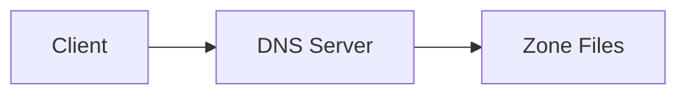

# Documentation

This directory contains the comprehensive documentation for the BIND DNS server with TSIG implementation.

## 📚 Documentation Structure

```
docs/
├── index.md                    # Main documentation homepage
├── getting-started/            # Getting started guides
│   ├── overview.md            # Project overview and concepts
│   ├── quick-start.md         # 5-minute setup guide
│   └── installation.md       # Detailed installation instructions
├── design/                    # Architecture and design documents
│   ├── architecture.md       # System architecture overview
│   └── tsig-security.md      # TSIG security implementation
├── user-guide/               # User guides and operations
│   └── basic-operations.md   # Daily operations guide
├── configuration/            # Configuration guides (planned)
├── api/                      # API reference (planned)
├── development/              # Development guides (planned)
└── assets/                   # Documentation assets
    ├── stylesheets/
    │   └── extra.css         # Custom CSS styling
    └── javascripts/
        └── mermaid.js        # Mermaid diagram configuration
```

## 🚀 Quick Start

### Prerequisites

```bash
# Install MkDocs and dependencies
pip install -r docs-requirements.txt
```

### Local Development

```bash
# Serve documentation locally
mkdocs serve

# Documentation will be available at http://127.0.0.1:8000
```

### Building Documentation

```bash
# Build static documentation
mkdocs build

# Output will be in site/ directory
```

### Deploying Documentation

```bash
# Deploy to GitHub Pages (if configured)
mkdocs gh-deploy

# Or build and deploy to your web server
mkdocs build
rsync -av site/ user@server:/var/www/docs/
```

## ✨ Features

### 🎨 Visual Features
- **Material Design** theme with dark/light mode
- **Custom DNS-themed** color scheme
- **Responsive design** for all devices
- **Professional styling** with DNS-specific components

### 📊 Interactive Elements
- **Mermaid diagrams** for architecture visualization
- **Code syntax highlighting** with copy buttons
- **Tabbed content** for multi-platform instructions
- **Admonitions** for tips, warnings, and notes

### 🔧 Technical Features
- **Search functionality** across all documentation
- **Git revision dates** on each page
- **Navigation breadcrumbs** and table of contents
- **Print-friendly** styling for offline use

## 📝 Writing Documentation

### Markdown Extensions

The documentation supports advanced Markdown features:

#### Code Blocks with Syntax Highlighting
```yaml
# Example YAML with syntax highlighting
services:
  bind:
    image: bind9:latest
    ports:
      - "53:53/udp"
```

#### Admonitions
```markdown
!!! tip "Pro Tip"
    Use TSIG keys for secure DNS operations

!!! warning "Security Warning"
    Change default keys in production

!!! note "Information"
    This is an informational note
```

#### Tabbed Content
```markdown
=== "Docker"
    ```bash
    docker-compose up -d
    ```

=== "Native"
    ```bash
    systemctl start bind9
    ```
```

#### Mermaid Diagrams
```markdown

```

#### DNS-Specific Components

Use custom CSS classes for DNS-specific styling:

```html
<!-- TSIG Key Display -->
<span class="tsig-key">dGhpc2lzYXNhbXBsZWtleQ==</span>

<!-- DNS Record Type Badges -->
<span class="dns-record-type a">A</span>
<span class="dns-record-type cname">CNAME</span>
<span class="dns-record-type mx">MX</span>

<!-- Status Indicators -->
<span class="status-indicator running">Running</span>
<span class="status-indicator stopped">Stopped</span>
<span class="status-indicator warning">Warning</span>
```

### File Organization

- **Keep related content together** in logical directories
- **Use descriptive filenames** that reflect the content
- **Include cross-references** between related documents
- **Update navigation** in `mkdocs.yml` when adding new pages

### Style Guidelines

- **Use clear, concise headings** with emoji for visual appeal
- **Include code examples** for all procedures
- **Add diagrams** for complex concepts
- **Provide both quick and detailed instructions**
- **Include troubleshooting sections** for common issues

## 🤝 Contributing to Documentation

### Adding New Pages

1. Create the Markdown file in the appropriate directory
2. Add the page to the navigation in `mkdocs.yml`
3. Test locally with `mkdocs serve`
4. Commit and push changes

### Updating Existing Pages

1. Edit the Markdown file
2. Preview changes locally
3. Test all links and references
4. Commit with descriptive message

### Adding Diagrams

Use Mermaid for diagrams. Examples:

- **Architecture diagrams**: Use flowcharts or component diagrams
- **Process flows**: Use sequence diagrams
- **State transitions**: Use state diagrams
- **Timelines**: Use Gantt charts

## 🎯 Documentation Goals

- **Comprehensive coverage** of all DNS server features
- **Clear instructions** for users of all skill levels
- **Professional appearance** suitable for enterprise use
- **Easy maintenance** and updates
- **Searchable content** for quick reference

## 📞 Getting Help

If you need help with the documentation:

1. Check the [MkDocs documentation](https://mkdocs.org)
2. Review [Material theme docs](https://squidfunk.github.io/mkdocs-material/)
3. Look at existing pages for examples
4. Ask in project discussions or issues

---

This documentation system provides a solid foundation for maintaining high-quality technical documentation that grows with your project.
