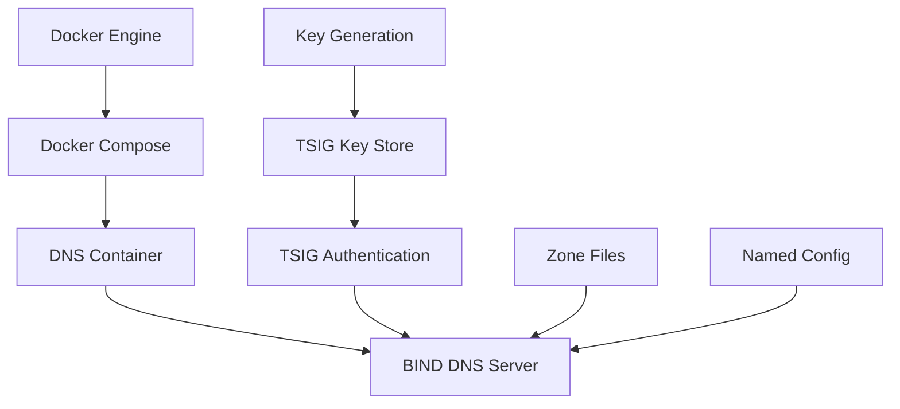
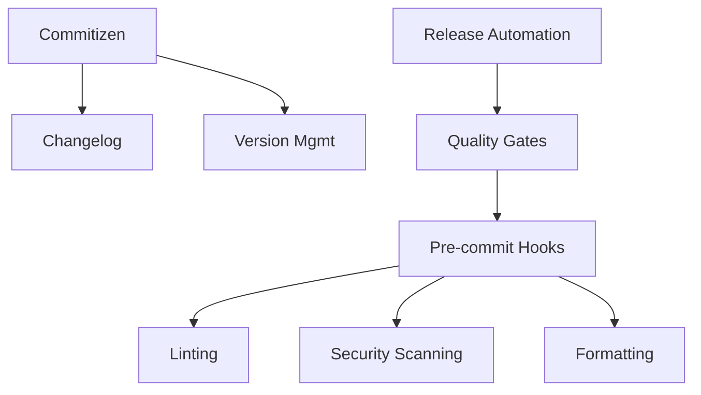

# System Components

This document provides a comprehensive overview of all components in the BIND DNS server system. Each component is assigned a unique identifier with the prefix CMP-XXX for tracking and reference purposes.

## Component Overview

The BIND DNS system consists of multiple interconnected components organized into logical layers:

- **Core DNS Services** (CMP-001 to CMP-009)
- **Security & Authentication** (CMP-010 to CMP-019)
- **Container & Orchestration** (CMP-020 to CMP-029)
- **Development & Testing** (CMP-030 to CMP-039)
- **Quality & Release Management** (CMP-040 to CMP-049)
- **Documentation & Configuration** (CMP-050 to CMP-059)
- **Integration & Use Cases** (CMP-060 to CMP-069)

## Component Reference Table

| Component ID | Component Name | Type | Description | Location | Dependencies | Status |
|--------------|----------------|------|-------------|----------|--------------|--------|
| **CMP-001** | BIND DNS Server | Core Service | Authoritative DNS server providing name resolution | Docker Container | CMP-021, CMP-011 | Active |
| **CMP-002** | DNS Zone Files | Configuration | DNS zone configuration and record definitions | `config/zones/` | CMP-001 | Active |
| **CMP-003** | Named Configuration | Configuration | BIND server configuration file | `config/named.conf` | CMP-001, CMP-002 | Active |
| **CMP-004** | DNS Query Handler | Service Logic | Processes incoming DNS queries | Built-in BIND | CMP-001 | Active |
| **CMP-005** | Zone Transfer Service | Service Logic | Handles AXFR/IXFR zone transfers | Built-in BIND | CMP-001, CMP-011 | Active |
| **CMP-006** | DNS Forwarders | Network | Upstream DNS servers for recursive queries | External | CMP-001 | Active |
| **CMP-007** | Health Check Service | Monitoring | DNS server health monitoring | Docker Compose | CMP-001 | Active |
| **CMP-008** | Logging Service | Monitoring | DNS query and error logging | Built-in BIND | CMP-001 | Active |
| **CMP-009** | Statistics Service | Monitoring | DNS performance metrics collection | Built-in BIND | CMP-001 | Active |
| **CMP-010** | TSIG Authentication | Security | Transaction signature authentication | Built-in BIND | CMP-001, CMP-012 | Active |
| **CMP-011** | TSIG Key Store | Security | Secure storage of TSIG keys | Environment Variables | CMP-012 | Active |
| **CMP-012** | Key Generation Service | Security | Automated TSIG key generation | `env-manager.sh` | CMP-011 | Active |
| **CMP-013** | Access Control Lists | Security | IP-based access restrictions | BIND Configuration | CMP-001 | Active |
| **CMP-014** | Update Policies | Security | DNS update authorization rules | BIND Configuration | CMP-001, CMP-010 | Active |
| **CMP-015** | Encryption Service | Security | TLS/SSL encryption for DNS-over-HTTPS | Optional | CMP-001 | Optional |
| **CMP-016** | RNDC Control | Security | Remote name daemon control | Built-in BIND | CMP-001, CMP-011 | Active |
| **CMP-017** | Security Monitoring | Security | Security event logging and alerting | Built-in BIND | CMP-008 | Active |
| **CMP-018** | Key Rotation Service | Security | Automated TSIG key rotation | `env-manager.sh` | CMP-011, CMP-012 | Planned |
| **CMP-019** | Certificate Management | Security | SSL/TLS certificate lifecycle | External | CMP-015 | Optional |
| **CMP-020** | Docker Engine | Infrastructure | Container runtime environment | Docker | - | Required |
| **CMP-021** | Docker Compose | Orchestration | Multi-container application orchestration | `docker-compose.yml` | CMP-020 | Active |
| **CMP-022** | DNS Container Image | Container | BIND DNS server container image | Docker Registry | CMP-020 | Active |
| **CMP-023** | Volume Management | Storage | Persistent storage for DNS data | Docker Volumes | CMP-021 | Active |
| **CMP-024** | Network Configuration | Network | Container networking setup | Docker Networks | CMP-021 | Active |
| **CMP-025** | Resource Limits | Resource Mgmt | CPU and memory constraints | Docker Compose | CMP-021 | Active |
| **CMP-026** | Health Checks | Monitoring | Container health monitoring | Docker Compose | CMP-021, CMP-007 | Active |
| **CMP-027** | Service Discovery | Network | Container service resolution | Docker Compose | CMP-021 | Active |
| **CMP-028** | Load Balancing | Network | DNS traffic distribution | External | CMP-001 | Optional |
| **CMP-029** | Backup Service | Storage | Automated configuration backup | `env-manager.sh` | CMP-023 | Active |
| **CMP-030** | Development Environment | Development | Devbox development setup | `devbox.json` | - | Active |
| **CMP-031** | DNS Client Container | Testing | Alpine-based testing environment | `Dockerfile.dns-client` | CMP-020 | Active |
| **CMP-032** | Testing Framework | Testing | Automated DNS testing scripts | Container Scripts | CMP-031 | Active |
| **CMP-033** | DNSControl Tool | Development | JavaScript DNS management | Container/Devbox | CMP-031 | Active |
| **CMP-034** | octoDNS Tool | Development | Python DNS synchronization | Container/Devbox | CMP-031 | Active |
| **CMP-035** | Dig Utilities | Testing | DNS query tools | Container/Devbox | CMP-031 | Active |
| **CMP-036** | Example Configurations | Development | Sample DNS configurations | Auto-generated | CMP-031 | Active |
| **CMP-037** | Integration Tests | Testing | End-to-end testing suite | Container Scripts | CMP-031, CMP-001 | Active |
| **CMP-038** | Performance Tests | Testing | DNS performance benchmarking | Scripts | CMP-031 | Planned |
| **CMP-039** | Mock Services | Testing | Simulated external services | Container Scripts | CMP-031 | Planned |
| **CMP-040** | Pre-commit Hooks | Quality | Code quality enforcement | `.pre-commit-config.yaml` | - | Active |
| **CMP-041** | Linting Services | Quality | Code syntax and style validation | Multiple Tools | CMP-040 | Active |
| **CMP-042** | Security Scanning | Quality | Vulnerability and secret detection | Pre-commit Hooks | CMP-040 | Active |
| **CMP-043** | Formatting Tools | Quality | Automatic code formatting | Multiple Tools | CMP-040 | Active |
| **CMP-044** | Documentation Linting | Quality | Documentation quality checks | markdownlint | CMP-040 | Active |
| **CMP-045** | Commitizen Service | Release Mgmt | Semantic versioning and commits | `pyproject.toml` | - | Active |
| **CMP-046** | Changelog Generator | Release Mgmt | Automated changelog creation | Commitizen | CMP-045 | Active |
| **CMP-047** | Version Management | Release Mgmt | Multi-file version synchronization | Commitizen | CMP-045 | Active |
| **CMP-048** | Release Automation | Release Mgmt | Automated release workflow | `scripts/release.sh` | CMP-045 | Active |
| **CMP-049** | Quality Gates | Quality | Release validation checks | Release Script | CMP-040, CMP-048 | Active |
| **CMP-050** | MkDocs Framework | Documentation | Documentation site generator | `mkdocs.yml` | - | Active |
| **CMP-051** | Documentation Content | Documentation | Markdown documentation files | `docs/` | CMP-050 | Active |
| **CMP-052** | Mermaid Diagrams | Documentation | Visual architecture diagrams | Markdown | CMP-050 | Active |
| **CMP-053** | Navigation Structure | Documentation | Documentation organization | MkDocs Config | CMP-050 | Active |
| **CMP-054** | Environment Templates | Configuration | Environment file templates | `env/` | - | Active |
| **CMP-055** | Configuration Validation | Configuration | Settings validation scripts | `env-manager.sh` | - | Active |
| **CMP-056** | Example Files | Configuration | Sample configuration files | Various | - | Active |
| **CMP-057** | Setup Scripts | Automation | Installation and setup automation | `scripts/` | - | Active |
| **CMP-058** | Build Configuration | Build System | Project build and packaging | `pyproject.toml` | - | Active |
| **CMP-059** | Environment Management | Configuration | Multi-environment configuration | `env-manager.sh` | CMP-054 | Active |
| **CMP-060** | External-DNS Integration | Integration | Kubernetes DNS automation | Use Case UC-001 | CMP-001, CMP-010 | Active |
| **CMP-061** | DNSControl Integration | Integration | Declarative DNS management | Use Case UC-002 | CMP-001, CMP-010 | Active |
| **CMP-062** | octoDNS Integration | Integration | Multi-provider DNS sync | Use Case UC-003 | CMP-001, CMP-010 | Active |
| **CMP-063** | Kubernetes Client | Integration | K8s API interaction | External-DNS | CMP-060 | Optional |
| **CMP-064** | API Gateway | Integration | RESTful DNS management API | Future | CMP-001 | Planned |
| **CMP-065** | Webhook Service | Integration | Event-driven DNS updates | Future | CMP-001 | Planned |
| **CMP-066** | Monitoring Integration | Integration | External monitoring systems | Future | CMP-008 | Planned |
| **CMP-067** | Log Aggregation | Integration | Centralized log collection | Future | CMP-008 | Planned |
| **CMP-068** | Backup Integration | Integration | External backup services | Future | CMP-029 | Planned |
| **CMP-069** | Cloud Providers | Integration | Cloud DNS service integration | Future | CMP-062 | Planned |

## Component Categories

### Core DNS Services (CMP-001 to CMP-009)

These components form the foundation of the DNS service:

- **CMP-001 BIND DNS Server**: The central authoritative DNS server
- **CMP-002 DNS Zone Files**: Configuration defining DNS records
- **CMP-003 Named Configuration**: BIND server configuration
- **CMP-004 DNS Query Handler**: Query processing logic
- **CMP-005 Zone Transfer Service**: Secondary DNS support
- **CMP-006 DNS Forwarders**: Upstream DNS resolution
- **CMP-007 Health Check Service**: Service monitoring
- **CMP-008 Logging Service**: Operational logging
- **CMP-009 Statistics Service**: Performance metrics

### Security & Authentication (CMP-010 to CMP-019)

Security-focused components ensuring safe DNS operations:

- **CMP-010 TSIG Authentication**: Transaction signature validation
- **CMP-011 TSIG Key Store**: Secure key storage
- **CMP-012 Key Generation Service**: Automated key creation
- **CMP-013 Access Control Lists**: IP-based restrictions
- **CMP-014 Update Policies**: DNS update authorization
- **CMP-015 Encryption Service**: TLS/SSL encryption
- **CMP-016 RNDC Control**: Remote management
- **CMP-017 Security Monitoring**: Security event tracking
- **CMP-018 Key Rotation Service**: Automated key rotation
- **CMP-019 Certificate Management**: SSL certificate lifecycle

### Container & Orchestration (CMP-020 to CMP-029)

Components managing containerized deployment:

- **CMP-020 Docker Engine**: Container runtime
- **CMP-021 Docker Compose**: Multi-container orchestration
- **CMP-022 DNS Container Image**: BIND container image
- **CMP-023 Volume Management**: Persistent storage
- **CMP-024 Network Configuration**: Container networking
- **CMP-025 Resource Limits**: Resource constraints
- **CMP-026 Health Checks**: Container health monitoring
- **CMP-027 Service Discovery**: Container service resolution
- **CMP-028 Load Balancing**: Traffic distribution
- **CMP-029 Backup Service**: Configuration backup

### Development & Testing (CMP-030 to CMP-039)

Components supporting development and testing workflows:

- **CMP-030 Development Environment**: Devbox setup
- **CMP-031 DNS Client Container**: Testing environment
- **CMP-032 Testing Framework**: Automated testing
- **CMP-033 DNSControl Tool**: JavaScript DNS management
- **CMP-034 octoDNS Tool**: Python DNS synchronization
- **CMP-035 Dig Utilities**: DNS query tools
- **CMP-036 Example Configurations**: Sample configurations
- **CMP-037 Integration Tests**: End-to-end testing
- **CMP-038 Performance Tests**: Performance benchmarking
- **CMP-039 Mock Services**: Service simulation

### Quality & Release Management (CMP-040 to CMP-049)

Components ensuring code quality and managing releases:

- **CMP-040 Pre-commit Hooks**: Quality enforcement
- **CMP-041 Linting Services**: Code validation
- **CMP-042 Security Scanning**: Vulnerability detection
- **CMP-043 Formatting Tools**: Code formatting
- **CMP-044 Documentation Linting**: Documentation quality
- **CMP-045 Commitizen Service**: Semantic versioning
- **CMP-046 Changelog Generator**: Release notes
- **CMP-047 Version Management**: Version synchronization
- **CMP-048 Release Automation**: Release workflow
- **CMP-049 Quality Gates**: Release validation

### Documentation & Configuration (CMP-050 to CMP-059)

Components managing documentation and configuration:

- **CMP-050 MkDocs Framework**: Documentation generator
- **CMP-051 Documentation Content**: Markdown content
- **CMP-052 Mermaid Diagrams**: Visual diagrams
- **CMP-053 Navigation Structure**: Documentation organization
- **CMP-054 Environment Templates**: Configuration templates
- **CMP-055 Configuration Validation**: Settings validation
- **CMP-056 Example Files**: Sample files
- **CMP-057 Setup Scripts**: Automation scripts
- **CMP-058 Build Configuration**: Build system
- **CMP-059 Environment Management**: Multi-environment support

### Integration & Use Cases (CMP-060 to CMP-069)

Components enabling external integrations:

- **CMP-060 External-DNS Integration**: Kubernetes automation
- **CMP-061 DNSControl Integration**: Declarative management
- **CMP-062 octoDNS Integration**: Multi-provider sync
- **CMP-063 Kubernetes Client**: K8s API interaction
- **CMP-064 API Gateway**: RESTful DNS API
- **CMP-065 Webhook Service**: Event-driven updates
- **CMP-066 Monitoring Integration**: External monitoring
- **CMP-067 Log Aggregation**: Centralized logging
- **CMP-068 Backup Integration**: External backup
- **CMP-069 Cloud Providers**: Cloud DNS integration

## Component Dependencies

### Critical Path Dependencies

### Quality & Release Dependencies

## Component Status Legend

| Status | Description |
|--------|-------------|
| **Active** | Currently implemented and operational |
| **Planned** | Designed but not yet implemented |
| **Optional** | Available but not required for basic operation |
| **Required** | External dependency required for operation |

## Maintenance and Updates

### Regular Maintenance Components

Components requiring regular maintenance:

- **CMP-011 TSIG Key Store**: Key rotation schedule
- **CMP-029 Backup Service**: Backup retention policies
- **CMP-040 Pre-commit Hooks**: Hook version updates
- **CMP-045 Commitizen Service**: Tool updates
- **CMP-050 MkDocs Framework**: Documentation updates

### Security-Critical Components

Components requiring immediate attention for security updates:

- **CMP-001 BIND DNS Server**: DNS server security patches
- **CMP-010 TSIG Authentication**: Authentication security
- **CMP-022 DNS Container Image**: Base image security updates
- **CMP-042 Security Scanning**: Security tool updates

This component reference provides a comprehensive view of the entire BIND DNS system architecture, enabling effective system management, troubleshooting, and future development planning.
