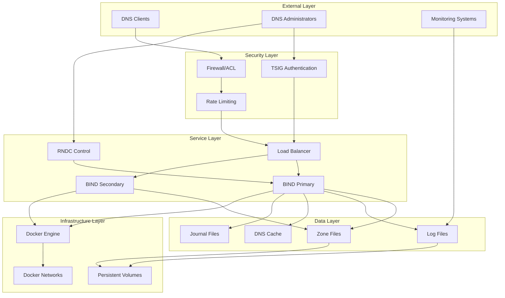
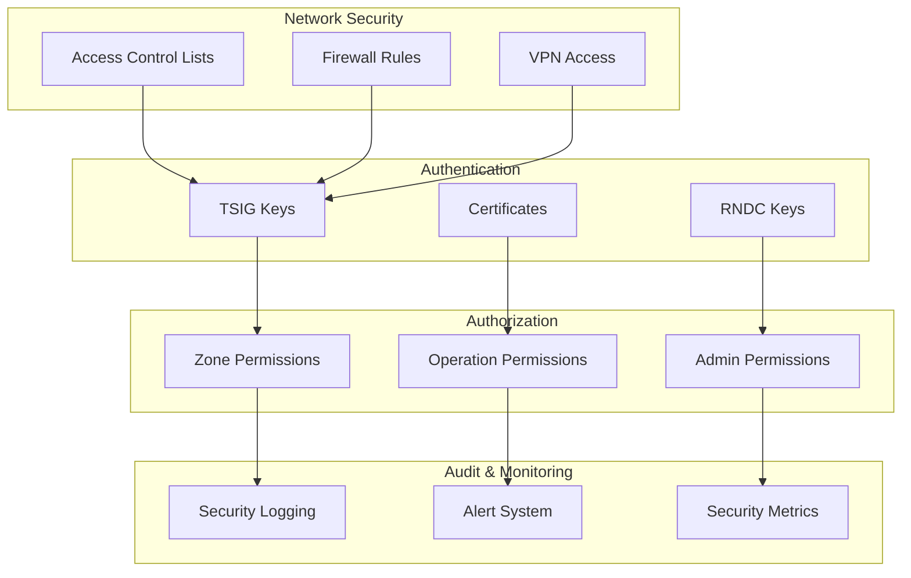
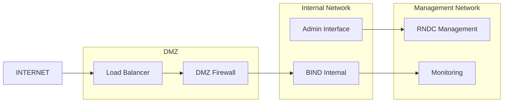
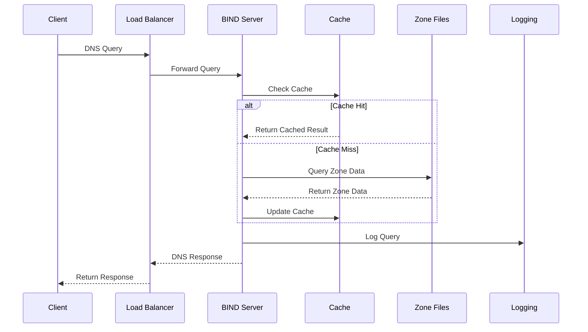
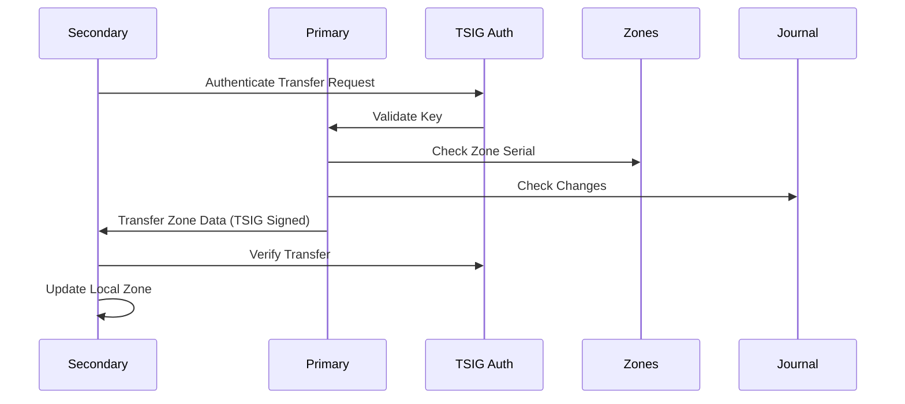
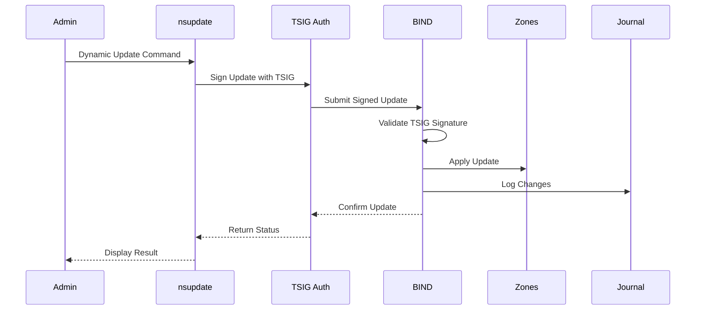
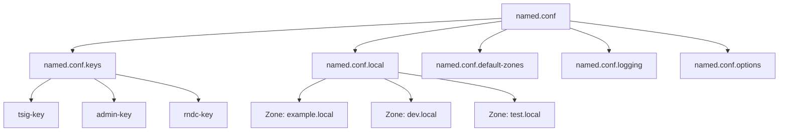
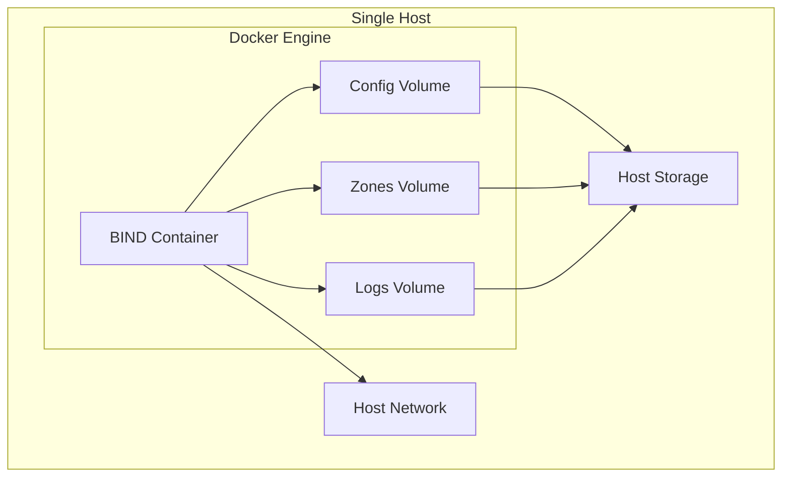
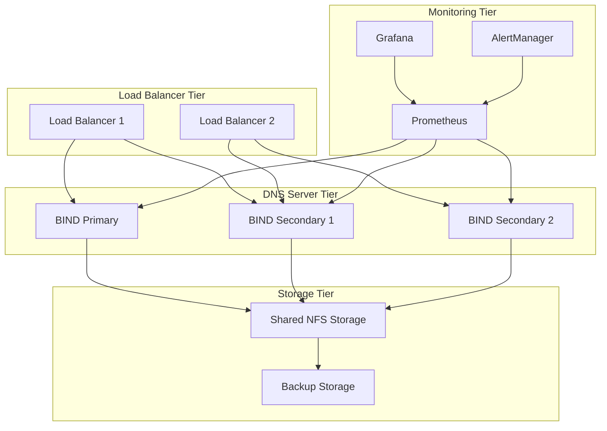

# Architecture

This document describes the architectural design of the BIND DNS server with TSIG implementation, covering the overall system design, component interactions, and design decisions.

## 🏗️ System Architecture

The DNS server architecture follows a layered approach with clear separation of concerns:



## 🧩 Component Overview

### DNS Server Core

#### BIND 9.19
- **Role**: Primary DNS resolution engine
- **Features**: 
  - Full RFC compliance
  - DNSSEC support
  - Advanced caching
  - Zone transfer capabilities
- **Configuration**: Modular configuration with separate files for different concerns

#### TSIG Authentication
- **Role**: Security layer for DNS operations
- **Algorithms**: HMAC-SHA256 (recommended), HMAC-MD5 (legacy support)
- **Key Management**: Three-tier key system for different operation levels

### Container Infrastructure

#### Docker Compose Stack
```yaml
# High-level service architecture
services:
  bind:                    # Primary DNS service
    image: bind9:9.19
    networks: [dns-net]
    volumes: [config, zones, logs]
    
  bind-secondary:          # Optional secondary DNS
    image: bind9:9.19
    depends_on: [bind]
    
  monitoring:              # Optional monitoring stack
    image: prometheus
    depends_on: [bind]
```

#### Volume Architecture
```
/data/
├── config/              # BIND configuration files
│   ├── named.conf      # Main configuration
│   ├── *.keys         # TSIG key definitions
│   └── *.zones        # Zone definitions
├── zones/              # Zone data files
│   ├── *.zone         # Zone records
│   └── *.jnl          # Journal files
└── logs/               # Log files
    ├── named.log      # General logs
    ├── security.log   # Security events
    └── queries.log    # Query logs
```

## 🔐 Security Architecture

### Multi-Layer Security Model



### TSIG Key Hierarchy

| Key Level | Purpose | Scope | Rotation |
|-----------|---------|-------|----------|
| Master Key | Zone transfers, critical ops | Global | Annually |
| Admin Key | Administrative operations | Admin scope | Quarterly |
| Service Key | Application updates | Service scope | Monthly |
| RNDC Key | Remote control | Control scope | Quarterly |

### Security Zones



## 📊 Data Flow Architecture

### DNS Query Processing



### Zone Transfer Process



### Dynamic Update Flow



## 🔧 Configuration Architecture

### Modular Configuration Design

```
config/
├── named.conf              # Main entry point
├── named.conf.keys         # TSIG key definitions
├── named.conf.local        # Local zone definitions
├── named.conf.default-zones # Standard zones
├── named.conf.logging      # Logging configuration
└── named.conf.options      # Global options
```

### Configuration Hierarchy



## 🚀 Deployment Architecture

### Single Node Deployment



### High Availability Deployment



## 🎯 Design Principles

### 1. Security First
- TSIG authentication for all critical operations
- Least privilege access control
- Comprehensive audit logging
- Regular security updates

### 2. Scalability
- Horizontal scaling through secondary servers
- Efficient caching strategies
- Load balancing capabilities
- Resource optimization

### 3. Reliability
- Redundant DNS servers
- Automatic failover mechanisms
- Data consistency through journal files
- Regular backups and disaster recovery

### 4. Maintainability
- Modular configuration structure
- Clear separation of concerns
- Comprehensive documentation
- Automated testing and validation

### 5. Observability
- Detailed logging at multiple levels
- Metrics collection and monitoring
- Health checks and alerting
- Performance tracking

## 🔄 Integration Points

### External System Integration

| System | Integration Method | Purpose |
|--------|-------------------|---------|
| LDAP/AD | TSIG key management | Authentication |
| Monitoring | Log shipping, metrics | Observability |
| CI/CD | API integration | Automation |
| Cloud DNS | Zone synchronization | Hybrid cloud |
| IPAM | IP address management | Network integration |

### API Interfaces

- **RNDC Interface**: Remote control and management
- **Dynamic Update API**: Real-time record updates
- **Zone Transfer Protocol**: Inter-server synchronization
- **Monitoring APIs**: Health and performance data

This architecture provides a solid foundation for a secure, scalable, and maintainable DNS infrastructure that can grow with your organization's needs.
