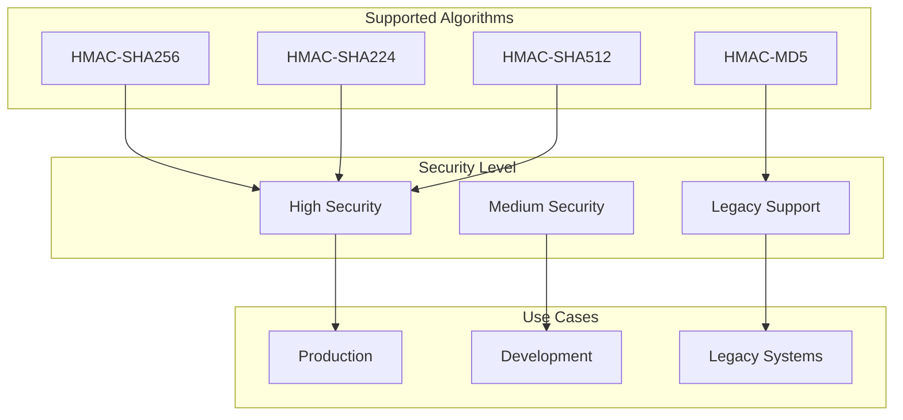
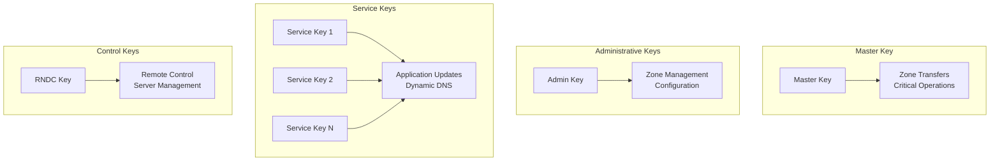
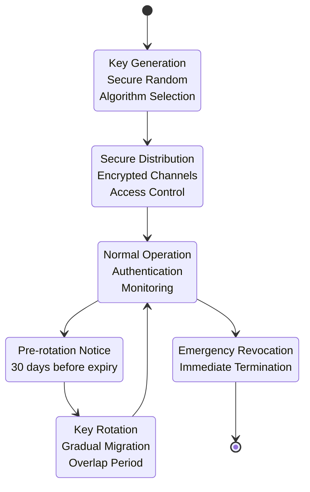
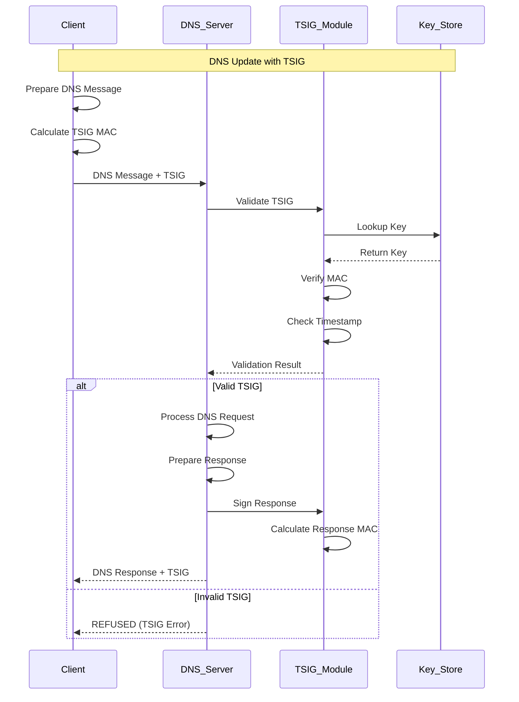
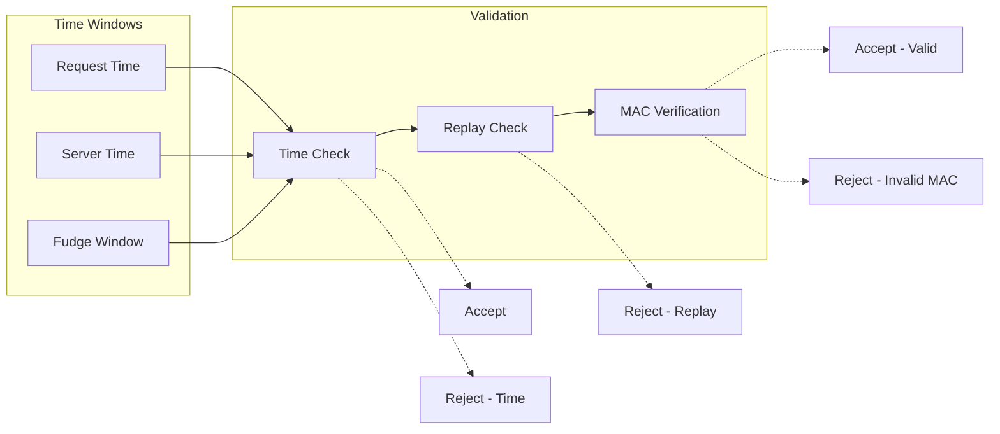
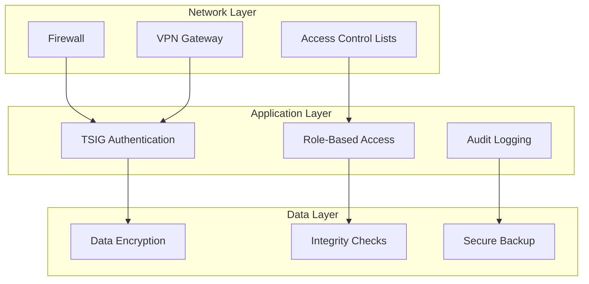
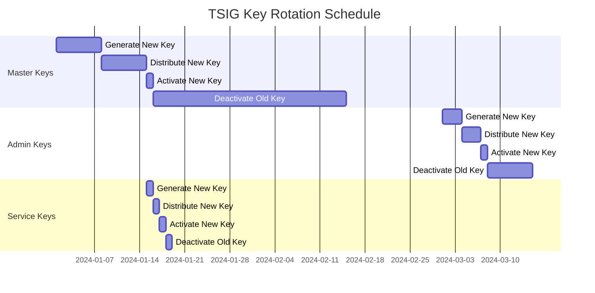
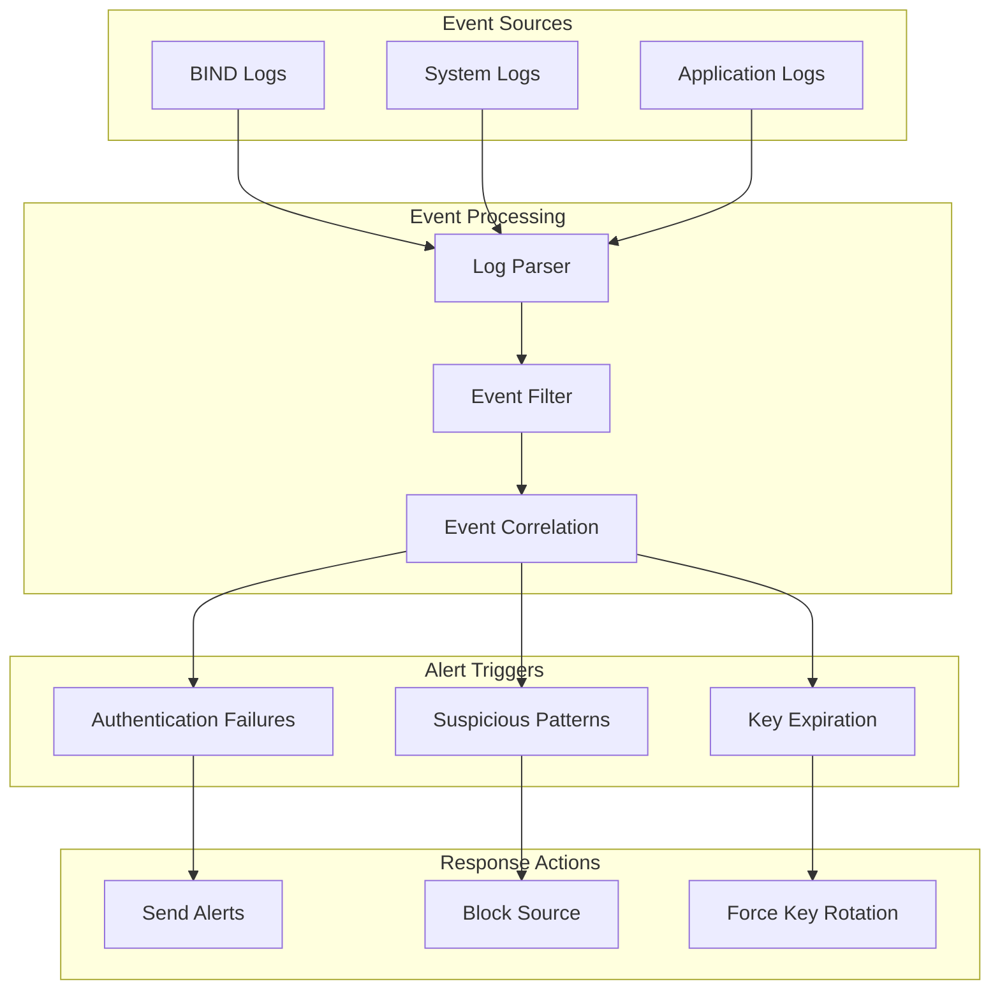
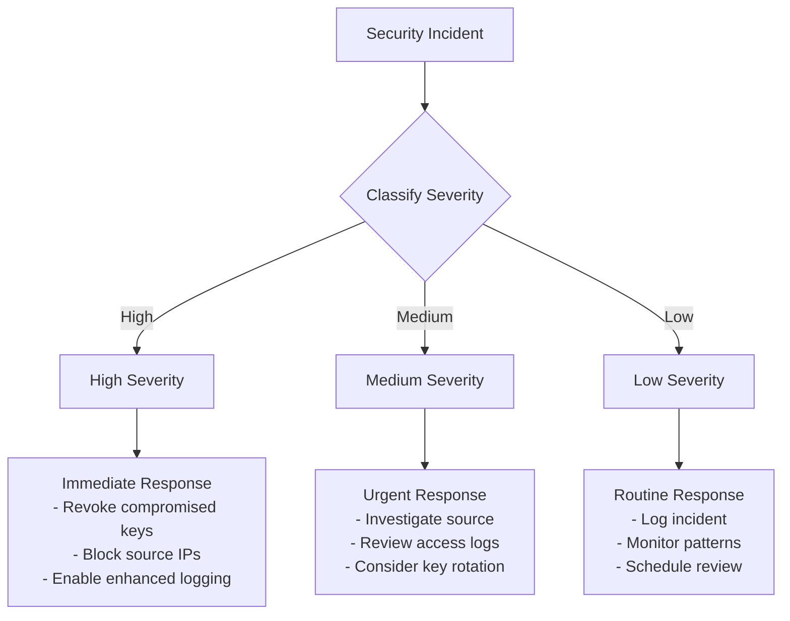

# TSIG Security Design

This document provides an in-depth look at the TSIG (Transaction Signature) security implementation, covering the cryptographic foundations, key management strategies, and security best practices.

## 🔐 TSIG Overview

TSIG (Transaction Signature) is a mechanism for securing DNS transactions using shared secret keys and message authentication codes (MACs). It provides:

- **Authentication**: Verifies the identity of the sender
- **Integrity**: Ensures messages haven't been tampered with
- **Replay Protection**: Prevents malicious replay attacks
- **Non-repudiation**: Provides proof of message origin

## 🧮 Cryptographic Foundation

### Hash Algorithms



### Key Properties

| Algorithm | Key Size | MAC Size | Security Level | Recommended |
|-----------|----------|----------|----------------|-------------|
| HMAC-SHA256 | 256 bits | 256 bits | High | ✅ Yes |
| HMAC-SHA224 | 224 bits | 224 bits | High | ✅ Yes |
| HMAC-SHA512 | 512 bits | 512 bits | High | ⚠️ Overkill |
| HMAC-MD5 | 128 bits | 128 bits | Low | ❌ Legacy only |

## 🗝️ Key Management Architecture

### Key Hierarchy



### Key Lifecycle



### Key Storage and Distribution

#### Secure Key Generation
```python
# Example key generation process
import secrets
import base64
import hashlib

def generate_tsig_key(algorithm='hmac-sha256', key_name='generated-key'):
    """
    Generate a cryptographically secure TSIG key
    """
    # Determine key length based on algorithm
    key_lengths = {
        'hmac-sha256': 32,  # 256 bits
        'hmac-sha224': 28,  # 224 bits
        'hmac-sha512': 64,  # 512 bits
        'hmac-md5': 16      # 128 bits (legacy)
    }
    
    key_length = key_lengths.get(algorithm, 32)
    
    # Generate cryptographically secure random key
    key_bytes = secrets.token_bytes(key_length)
    
    # Encode in base64 for BIND configuration
    key_b64 = base64.b64encode(key_bytes).decode('ascii')
    
    return {
        'name': key_name,
        'algorithm': algorithm,
        'secret': key_b64,
        'key_bytes': key_bytes
    }
```

#### Key Configuration Template
```yaml
# TSIG Key Configuration Template
key_configuration:
  master_key:
    name: "master-transfer-key"
    algorithm: "hmac-sha256"
    secret: "{{ MASTER_KEY_SECRET }}"
    purpose: "zone_transfers"
    rotation_days: 365
    
  admin_key:
    name: "admin-management-key"
    algorithm: "hmac-sha256"
    secret: "{{ ADMIN_KEY_SECRET }}"
    purpose: "zone_management"
    rotation_days: 90
    
  service_keys:
    - name: "app1-update-key"
      algorithm: "hmac-sha256"
      secret: "{{ APP1_KEY_SECRET }}"
      purpose: "dynamic_updates"
      rotation_days: 30
      
    - name: "app2-update-key"
      algorithm: "hmac-sha256" 
      secret: "{{ APP2_KEY_SECRET }}"
      purpose: "dynamic_updates"
      rotation_days: 30
```

## 🔒 Security Implementation

### TSIG Message Flow



### MAC Calculation Process

The TSIG MAC is calculated over:
1. **DNS Message**: The entire DNS message being authenticated
2. **Key Name**: The name of the TSIG key
3. **Timestamp**: Current time (prevents replay attacks)
4. **Fudge**: Time window for clock skew tolerance
5. **Algorithm**: The HMAC algorithm identifier

```
MAC = HMAC(key, message + key_name + timestamp + fudge + algorithm)
```

### Time-based Security



## 🛡️ Security Controls

### Access Control Matrix

| Operation | Master Key | Admin Key | Service Key | RNDC Key |
|-----------|------------|-----------|-------------|----------|
| Zone Transfer | ✅ | ❌ | ❌ | ❌ |
| Zone Update | ✅ | ✅ | ✅ | ❌ |
| Zone Management | ✅ | ✅ | ❌ | ❌ |
| Server Control | ❌ | ❌ | ❌ | ✅ |
| Query Resolution | ✅ | ✅ | ✅ | ❌ |

### Network Security Integration



## 🔄 Key Rotation Strategy

### Rotation Schedule



### Rotation Process

```bash
#!/bin/bash
# TSIG Key Rotation Script

rotate_tsig_key() {
    local key_name="$1"
    local algorithm="$2"
    
    echo "Starting rotation for key: $key_name"
    
    # Step 1: Generate new key
    new_key=$(generate_new_key "$algorithm")
    
    # Step 2: Distribute to all servers
    distribute_key "$key_name" "$new_key"
    
    # Step 3: Update configuration
    update_bind_config "$key_name" "$new_key"
    
    # Step 4: Reload BIND configuration
    reload_bind_config
    
    # Step 5: Wait for propagation
    sleep 300
    
    # Step 6: Verify new key works
    if test_key "$key_name" "$new_key"; then
        echo "New key verified successfully"
        
        # Step 7: Schedule old key removal
        schedule_key_removal "$key_name" "30d"
    else
        echo "New key verification failed, rolling back"
        rollback_key "$key_name"
    fi
}
```

## 📊 Security Monitoring

### TSIG Event Monitoring



### Security Metrics

| Metric | Threshold | Action |
|--------|-----------|--------|
| Authentication Failures | > 10/minute | Alert Security Team |
| Invalid TSIG Signatures | > 5/hour | Investigate Source |
| Key Expiration Warning | 30 days | Schedule Rotation |
| Unusual Update Patterns | Statistical Anomaly | Enhanced Monitoring |
| Time Synchronization Drift | > 5 minutes | Check NTP Service |

## 🚨 Security Incident Response

### Incident Classification



### Emergency Key Revocation

```bash
#!/bin/bash
# Emergency TSIG Key Revocation

emergency_revoke_key() {
    local key_name="$1"
    local reason="$2"
    
    echo "EMERGENCY: Revoking key $key_name - Reason: $reason"
    
    # Immediate actions
    remove_key_from_config "$key_name"
    reload_bind_immediately
    
    # Block all requests using this key
    add_firewall_block_for_key "$key_name"
    
    # Generate incident report
    generate_incident_report "$key_name" "$reason"
    
    # Notify security team
    send_emergency_alert "$key_name" "$reason"
    
    # Start key replacement process
    initiate_emergency_key_replacement "$key_name"
}
```

## 🎯 Best Practices

### Development Environment
- Use separate keys for development and production
- Implement key rotation testing in development
- Regular security audits of key usage
- Automated testing of TSIG configurations

### Production Environment
- Implement defense in depth (network + TSIG + monitoring)
- Regular key rotation according to policy
- Secure key storage with encryption at rest
- Comprehensive audit logging and monitoring

### Operational Security
- Principle of least privilege for key access
- Secure key distribution channels
- Regular security assessments
- Incident response procedures

This TSIG security design provides a robust foundation for securing DNS operations while maintaining operational flexibility and monitoring capabilities.
