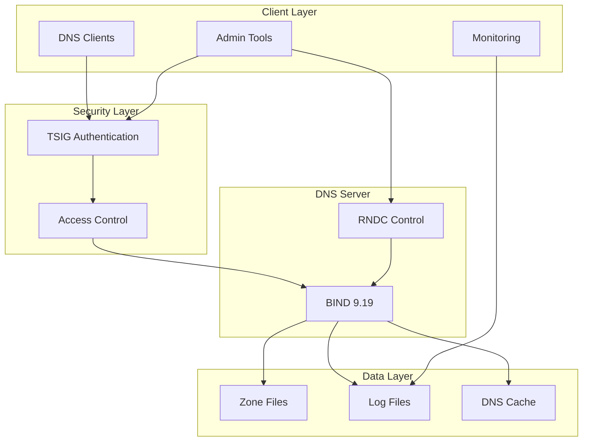

# Overview

Welcome to the BIND DNS Server with TSIG documentation! This section will help you understand what this project provides and guide you through the initial setup process.

## What is TSIG?

TSIG (Transaction Signature) is a mechanism used to secure DNS communications. It provides:

- **Authentication**: Verifies the identity of DNS clients and servers
- **Data Integrity**: Ensures DNS messages haven't been tampered with
- **Replay Protection**: Prevents malicious replay of DNS transactions

!!! info "Why TSIG Matters"
    In enterprise environments, DNS security is crucial. TSIG enables secure zone transfers, authenticated dynamic updates, and trusted communication between DNS servers.

## Project Components

This project consists of several key components:

### 🐳 Docker Infrastructure
- **BIND 9.19** container with optimized configuration
- **Docker Compose** setup for easy deployment
- **Volume mounts** for persistent configuration and data
- **Health checks** for monitoring container status

### 🔐 Security Layer
- **TSIG keys** for authentication
- **Access control lists** for network security
- **Secure logging** for audit trails
- **RNDC** for remote administration

### 📁 Zone Management
- **Sample zones** for different environments
- **Dynamic update** capabilities
- **Zone file validation** tools
- **Automated backup** mechanisms

## Prerequisites

Before you begin, ensure you have:

=== "Required"
    - Docker Engine 20.10+
    - Docker Compose 2.0+
    - Basic DNS knowledge
    - Linux/macOS/WSL environment

=== "Recommended"
    - `dig` utility for testing
    - `nsupdate` for dynamic updates
    - Git for version control
    - Text editor with YAML support

=== "Optional"
    - MkDocs for documentation
    - Grafana for monitoring
    - Prometheus for metrics collection

## Architecture Overview



## Deployment Models

Choose the deployment model that best fits your needs:

### Development Environment
Perfect for learning and testing DNS configurations.

```yaml
# Single container setup
services:
  bind:
    image: internetsystemsconsortium/bind9:9.19
    ports:
      - "53:53/udp"
    volumes:
      - ./config:/etc/bind
```

### Production Environment
High-availability setup with monitoring and backup.

```yaml
# Multi-container setup with monitoring
services:
  bind-primary:
    # Primary DNS server
  bind-secondary:
    # Secondary DNS server
  monitoring:
    # Prometheus/Grafana stack
```

### Hybrid Cloud
Integration with cloud DNS services for redundancy.

## Security Considerations

!!! warning "Security First"
    Always change default TSIG keys before production deployment!

Key security aspects to understand:

1. **TSIG Key Management**
   - Generate unique keys for each environment
   - Rotate keys regularly
   - Store keys securely

2. **Network Security**
   - Restrict DNS ports to trusted networks
   - Use firewalls for additional protection
   - Monitor for suspicious activity

3. **Access Control**
   - Implement least-privilege principles
   - Use separate keys for different operations
   - Regular security audits

## Next Steps

Now that you understand the basics, you can:

1. **[Quick Start](quick-start.md)** - Deploy your first DNS server
2. **[Installation](installation.md)** - Detailed setup instructions
3. **[Architecture](../design/architecture.md)** - Deep dive into the design

!!! tip "Learning Path"
    We recommend following the documentation in order: Overview → Quick Start → Installation → Design → User Guide
