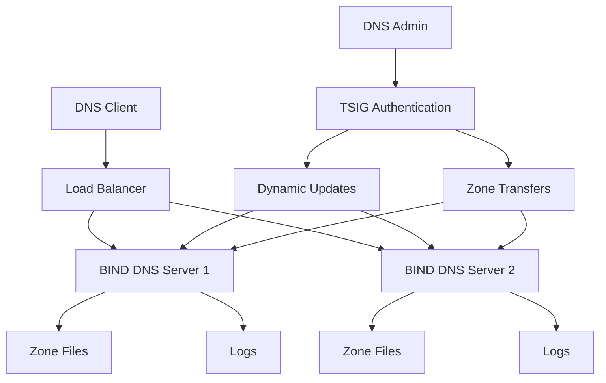

# BIND DNS Server with TSIG Documentation

Welcome to the comprehensive documentation for the BIND DNS server with TSIG (Transaction Signature) key capabilities. This documentation provides everything you need to deploy, configure, and manage a secure DNS infrastructure.

## 🚀 Quick Overview

This project provides a complete Docker-based solution for running a BIND DNS server with advanced security features:

!!! success "Key Features"
    - **BIND 9.19** - Latest stable DNS server
    - **TSIG Authentication** - Secure DNS operations
    - **Dynamic Updates** - Real-time DNS record management
    - **Zone Transfers** - Secure replication between servers
    - **Docker Compose** - Easy deployment and management
    - **Comprehensive Logging** - Detailed operational insights

## 📚 Documentation Structure

### Getting Started
Perfect for new users who want to quickly deploy and test the DNS server.

[Get Started :material-rocket:](getting-started/overview.md){ .md-button .md-button--primary }

### Design Documentation
Deep dive into the architecture, security model, and design decisions.

[View Architecture :material-sitemap:](design/architecture.md){ .md-button }

### User Guide
Step-by-step instructions for common operations and advanced configurations.

[User Guide :material-book-open-page-variant:](user-guide/basic-operations.md){ .md-button }

## 🎯 Use Cases

This DNS server solution is ideal for:

=== "Development"
    - Local development environments
    - Testing DNS configurations
    - Microservices discovery
    - Container orchestration

=== "Production"
    - Private DNS zones
    - Internal service discovery
    - Secure zone transfers
    - Enterprise DNS infrastructure

=== "Learning"
    - DNS protocol understanding
    - TSIG authentication
    - BIND configuration
    - Security best practices

## 🔧 Quick Start

1. **Clone the repository**
   ```bash
   git clone https://github.com/your-org/private-dns-zone.git
   cd private-dns-zone
   ```

2. **Start the DNS server**
   ```bash
   docker-compose up -d
   ```

3. **Test DNS resolution**
   ```bash
   dig @localhost www.example.local
   ```

!!! tip "First Time?"
    Check out our [Quick Start Guide](getting-started/quick-start.md) for a complete walkthrough.

## 🛡️ Security Features

The DNS server includes enterprise-grade security features:

| Feature | Description | Status |
|---------|-------------|--------|
| TSIG Keys | Cryptographic authentication for DNS operations | ✅ Implemented |
| Secure Transfers | Authenticated zone transfers between servers | ✅ Implemented |
| Dynamic Updates | Secure real-time DNS record updates | ✅ Implemented |
| Access Control | Network-based access restrictions | ✅ Implemented |
| Logging | Comprehensive security and operational logging | ✅ Implemented |

## 📊 Architecture Overview



## 🤝 Contributing

We welcome contributions! Whether you're fixing bugs, improving documentation, or adding new features, your help is appreciated.

Check the project repository for contribution guidelines and open issues.

## 📞 Support

Need help? Here are your options:

- 📖 Check the [User Guide](user-guide/basic-operations.md)
- 🔍 Review the troubleshooting section in the User Guide
- 🐛 Report issues on GitHub
- 💬 Join our community discussions

---

!!! info "Version Information"
    This documentation is for version 1.0.0 of the BIND DNS server with TSIG implementation.
