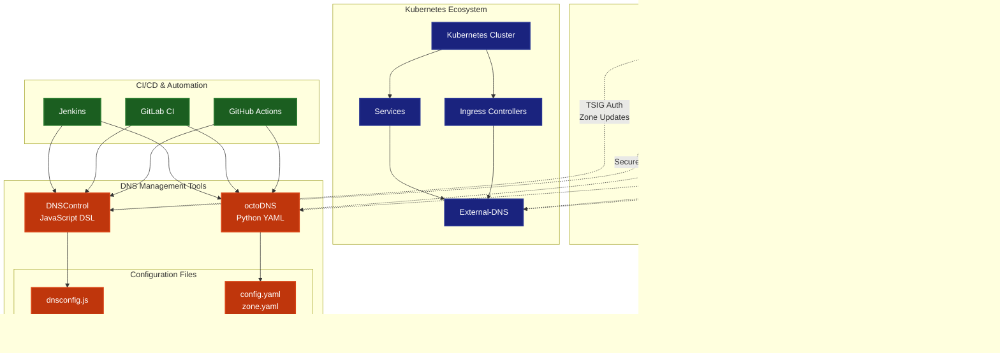

# UC-000: Use Cases Overview

This section provides a comprehensive overview of the different ways to integrate with your BIND DNS server setup. Each use case addresses specific needs and deployment scenarios.

## Integration Context Diagram

## Use Case Comparison

| Feature | External-DNS | DNSControl | octoDNS |
|---------|-------------|------------|---------|
| **Primary Use Case** | Kubernetes DNS automation | Declarative DNS management | Multi-provider DNS sync |
| **Configuration Language** | Kubernetes annotations | JavaScript DSL | YAML |
| **Automation Level** | Fully automatic | Semi-automatic | Semi-automatic |
| **Multi-Provider Support** | Yes (limited) | Yes (extensive) | Yes (extensive) |
| **Kubernetes Integration** | Native | Manual | Manual |
| **Validation** | Basic | Advanced | Advanced |
| **Rollback Support** | Limited | Yes | Yes |
| **Learning Curve** | Low | Medium | Medium |
| **Best For** | K8s-native workflows | Infrastructure as Code | Multi-cloud DNS |

## Integration Scenarios

### 1. External-DNS Integration
**When to use:** Kubernetes-native environments where DNS records should automatically reflect service and ingress changes.

### 2. DNSControl Integration
**When to use:** Infrastructure as Code approach with version-controlled DNS configurations and team collaboration.

### 3. octoDNS Integration
**When to use:** Multi-provider environments requiring DNS synchronization and advanced validation capabilities.

## Security Architecture

All integrations leverage the same security foundation:

## Choosing the Right Integration

### For Kubernetes Environments
- **Start with External-DNS** if you want automatic DNS management
- **Add DNSControl or octoDNS** for manual DNS records and infrastructure

### For Traditional Infrastructure
- **Use DNSControl** for JavaScript-familiar teams and simple setups
- **Use octoDNS** for complex multi-provider environments

### For Hybrid Environments
- **Combine External-DNS + DNSControl/octoDNS** for comprehensive DNS management
- Use External-DNS for dynamic K8s resources
- Use DNSControl/octoDNS for static infrastructure records

## Getting Started

1. **Set up your BIND DNS server** using the provided Docker Compose setup
2. **Generate TSIG keys** using `env-manager.sh generate-keys`
3. **Choose your integration approach** based on your requirements
4. **Follow the specific integration guide** for detailed setup instructions

## Next Steps

- [UC-001: External-DNS Integration](uc-001-external-dns.md) - Kubernetes-native DNS automation
- [UC-002: DNSControl Integration](uc-002-dnscontrol.md) - JavaScript-based DNS management
- [UC-003: octoDNS Integration](uc-003-octodns.md) - Python-based multi-provider DNS sync

Each integration guide provides detailed setup instructions, configuration examples, and best practices for secure DNS management.
